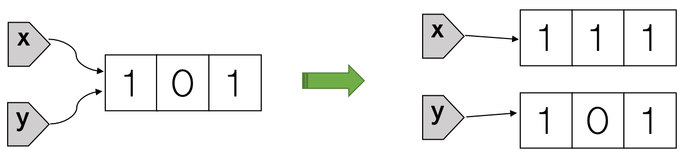
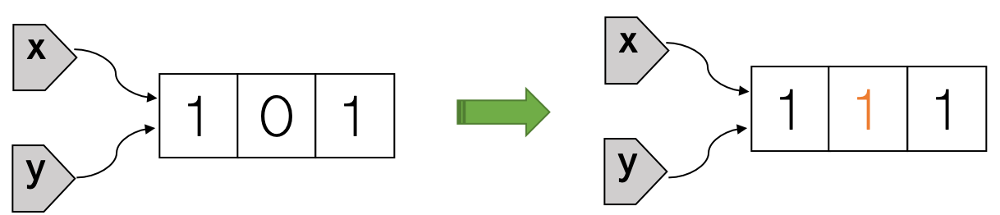

Do not confuse variable reassignment (or rebinding) with mutation. Reassignment in R changes the binding. (See the [second diagram](https://masterr.org/r/RFP-part4-shadowing/) for an example.) Mutation changes the referenced object itself. R supports limited mutation by default and base R objects are mostly immutable. As a result, R code often behaves like what we'd expect it to behave mathematically. This allows the programmer to focus on the mathematical or statistical problem at hand without being distracted by the "computer side of things." Indeed, if you're trained as a mathematician or statistician without any programming experience, you'll find it's easier to write R code than most typical programming languages like Python, Ruby, Java, C++, or Rust etc. 

## R objects are (mostly) immutable.

Consider the following R code, where x and y refer to the same list initially. If we change any element of x, the value of y will not be automatically changed. This is exactly what we would expect mathematically.


x = list(1, 0, 1)
y = x 
identical(pryr::address(x), pryr::address(y)) # x and y point to the same object



## [1] TRUE



x[[2]] = 1 # change the second element of x
print(x)   # x is changed



## [[1]]
## [1] 1
## 
## [[2]]
## [1] 1
## 
## [[3]]
## [1] 1



print(y)   # y is not changed     



## [[1]]
## [1] 1
## 
## [[2]]
## [1] 0
## 
## [[3]]
## [1] 1


The R code `x[[2]] = 1` gives the illusion of modifying the list referenced by x. Internally, it actually does two things: first create a modified copy of that list, then rebind x to the modified copy, leaving the original list unchanged. Because y is still bound to the original list, running `print(y)` will display the original list on screen. We summarize what's going on in the following diagram:

If we do the same thing in Python, as shown in the code block below, we'll discover that element change in x is also visible through y. This is often surprising to people without a formal training in programming. How could the value of y be changed when no operation was performed on y explicitly? The reason is because unlike lists in R, Python lists are mutable.


x = [1, 0, 1]
y = x
x[1] = 1 # change the second element of x, python list starts at index 0
print(x) # x is changed



## [1, 1, 1]



print(y) # y is also changed



## [1, 1, 1]



print(x is y) # x and y still refer to the same list, with its 2nd element changed to 1



## True


The python code `x[1] = 1` directly modifies the list referenced by x, updating its second element to a value of 1. There's no new list being created. Both x and y are still bound to the original list, which has the value of its second element changed from 0 to 1. This can be seen pictorially as follows:

## Copy on modify (if necessary)

Detailed oriented readers probably have noticed the title of the previous section has the word "mostly" in parenthesis: "R objects are (mostly) immutable." The implication is that some R objects (for example, lists and vectors) can also be mutable sometimes. Consider the following example, where there's only one variable x pointing to the list [-1, 0, 1]. Because there are no other variables that refer to the same list, updating any element of x will directly modify the list instead of making a modified copy.


{ # must use curly brackets to group code if running in Rstudio. No need of them if running inside of R directly.
        x = list(-1, 0, 1)
        print(pryr::address(x))
        x[[2]] = 1
        print(pryr::address(x))
        x[[3]] = -9
        print(pryr::address(x))
} # identical memory addresses show there was no rebinding and x always point to the same list. So it's the list itself that gets modified.



## [1] "0x7f8207893e48"
## [1] "0x7f8207893e48"
## [1] "0x7f8207893e48"


Consider another example where we first assign the vector `1:13` to a variable v then change v's elements:


{ # must use curly brackets to group code if running in Rstudio. No need of them if running inside of R directly.
        v = 1:13
        print(pryr::address(v))
        v[1] = 100  # makes a modified copy
        print(pryr::address(v)) # different memory address, indicating modified copy
        v[2] = -100 # modify the copy directly
        print(pryr::address(v)) # same memory address, indicating direct modification
}



## [1] "0x7f81fff33fc8"
## [1] "0x7f82057bfa98"
## [1] "0x7f82057bfa98"


Although there's no other variables pointing to the same vector, the first time we tried to change v's elements (`v[1] = 100`), R made a modified copy. When we tried to change v's elements for the second time (`v[2] = -100`), R didn't make another modified copy, instead, R modified the modified copy directly. 

In summary, it seems R is smart to know when to directly modify an object and when to make a modified copy. How does R do it? Well, it turns out that R implements something called "copy on modify (if necessary)," which means that copying is done only when we try to modify an object, and if the modification has no "spillover effects" (for example, making the value of other variables or non-local variables changed), R will just modify without copying.

