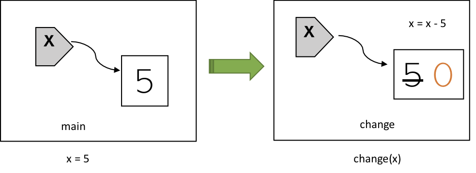
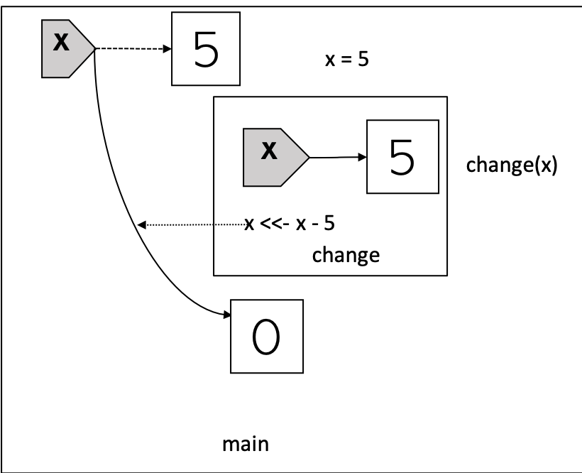

If you have been following this R Functional Programming (RFP) series[^1], you know by now we have discussed: 

* [how regular assignment operators `<-`/`=` work in R](https://masterr.org/r/RFP-part3-variables/), and
* [how "copy n modify" works in R](https://masterr.org/r/RFP-part5-immutability/).

In summary, we have the following facts about the R language: 

* Variable assignment binds symols to objects.
* Reassignment changes the binding. It doesn't modify data.
* Mutability is a property of objects. It has nothing to do with variables or variable assignment.
* Copy-n-modify is everywhere.

To better understand these facts, let's walk through two examples. The first example consists
of the following code block:


change = function(x) {
        x = x - 5
        print(paste("do work and get:", x, "at addr", pryr::address(x)))
}
main = function() {
        x = 5
        print(paste("start          :", x, "at addr", pryr::address(x)))
        
        change(x) # x is not changed. It still points to the same value 5
        print(paste("end            :", x, "at addr", pryr::address(x)))
}


What will happen if we call `main()`? 

1. `x` will be bound to 5.
2. 5 and its memory address will be printed.
3. `change(x)` will not change the value of `x`.
4. 5 and the same address will be printed.

Let's call it now:


main()



## [1] "start          : 5 at addr 0x7f875baea088"
## [1] "do work and get: 0 at addr 0x7f875ebda4e8"
## [1] "end            : 5 at addr 0x7f875baea088"


The output confirms our reasoning. When the line `change(x)` is executed, a new 
environment is created, then the value 5 is copied into this new environment and 
bound to a new variable `x`[^2]. When the line `x = x - 5` is run, 
R looks up the value 5 of this new `x` from this new environment, carries out the 
subtraction and rebinds `x` to the result 0. When the program steps out of the 
function `change()`, everything (`x`, 0, 5) inside of this new environment will 
be garbage collected. I want to point out that the original `x` in `main()` is 
never modified. See the following diagram:

## `<<-` Reassigns Variables in Outer Scope

Now let's look at the second example: 


main = function() {
        change = function(x) {
                x <<- x - 5
                print(paste("do work and get:", x, "at addr", pryr::address(x)))
        }
        
        x = 5
        print(paste("start          :", x, "at addr", pryr::address(x)))
        
        change(x) # x is changed. It now points to a new value 0 at a different location 
        print(paste("end            :", x, "at addr", pryr::address(x)))
}


This example differs from the first one at two places:

* `change()` is defined inside of `main()`. 
* `<<-` is used instead of `<-` or `=` (`x <<- x - 5` instead of `x = x - 5`).

The `<<-` operator is usually only used in functions. While operators `<-` and `=` perform variable assignment inside the environment (or scope) where they are evaluated, `<<-` causes a search through parent environments for the variable being assigned. If such a variable is found (and its binding is not locked) then its value is redefined, otherwise assignment takes place in the global environment. 
I'd like to point out that like `<-` and `=`, `<<-` also only changes the binding and doesn't modify data. 

In this example:

* `change()` defines an inner scope and `main()` defines an outer scope.
* because of `<<-`, `change(x)` changes the value of `x` defined in the outer scope.

When we call `main()`, the following will happen:

1. `change` will be bound to `function(x) { x <<- x - 5 ...}` in the outer scope.
2. `x` will be bound to 5 in the outer scope.
2. 5 and its memory address will be printed.
3. `change(x)` will change the value of outer `x` to 0 and print 5 and a different location.
4. 5 and yet another different location will be printed.

Let's call `main()` and look at the output:


main()



## [1] "start          : 5 at addr 0x7f875f47f810"
## [1] "do work and get: 5 at addr 0x7f875e8daa80"
## [1] "end            : 0 at addr 0x7f875fcd4340"


The 2nd line of output is particularly interesting. You're probably expecting it 
to print 0, but that wouldn't be correct. When the line `change(x)` is executed, a new 
environment is created, then the value 5 is copied into this new environment and 
bound to a new variable `x`[^2]. When the line `x <<- x - 5` is run, R looks up 
the value 5 of this new `x` from this new environment, carries out the subtraction 
and rebinds *the `x` in the outer scope* to the result 0. Notice that the 
inner variable `x` is still bound to 5. When R executes the line
`print(paste("do work and get:", x, "at addr", pryr::address(x)))`, it looks up the
value and address of the inner `x`, and hence prints 5. Of course, because this 5 
is a copy of the outer 5, it is a different 5 and hence has a different memory address.
See the following diagram:

To summarize, here're the facts about `<<-`:

* it's usually only used in functions.
* it reassigns outer variables by changing its binding.
* it never modifies data directly. 

Here's an example of how `<<-` can be used in real world:

[Mortgage Payment Schedule Calculator](https://masterr.org/r/understand-r-environments-part3/)

[^1]: If you haven't, I recommend you to read the linked posts first.
[^2]: different from the `x` in `main()`.
