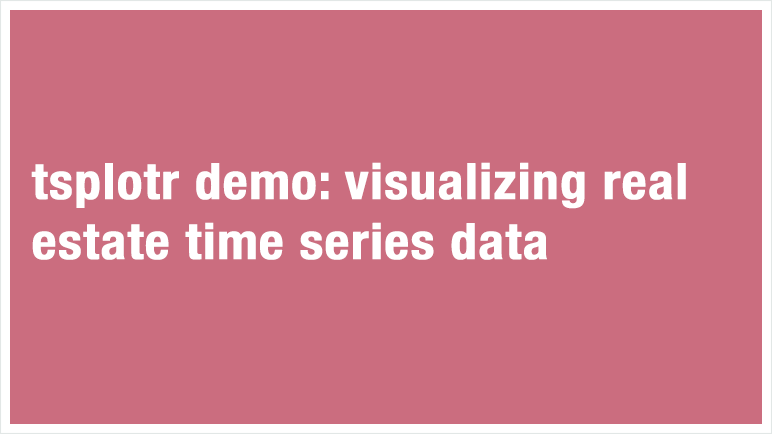
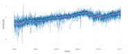
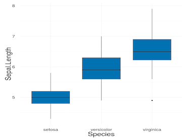

|  | This demo app uses a real estate dataset from one of Hadley's talk and shows you how to visualize time series data and removes seasonalities to see general patterns.|

|  | This app allows you to visualize your own time series data by removing seasonalities to reveal general patterns. Make sure you take a look at the tsplotr demo app above first to learn how to use it.|

|  | You can use this app to explore your data. No coding needed. Make sure you clean your data first before uploading.|
