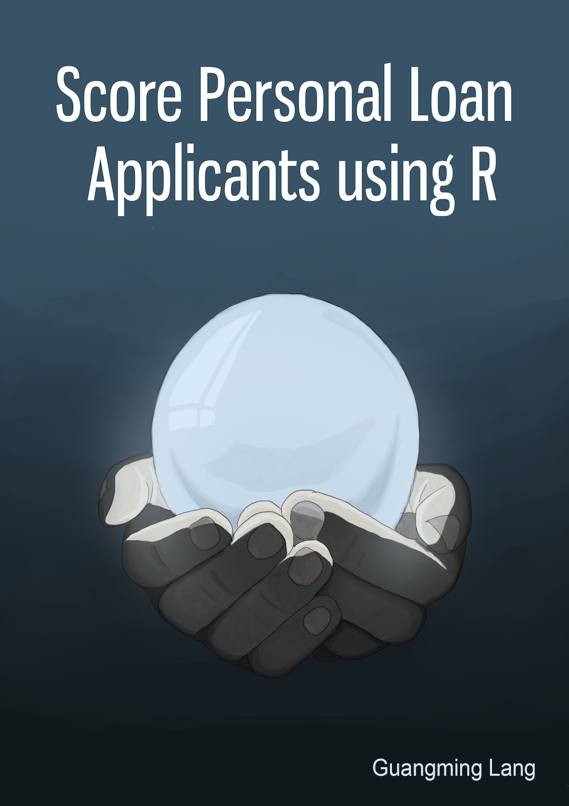
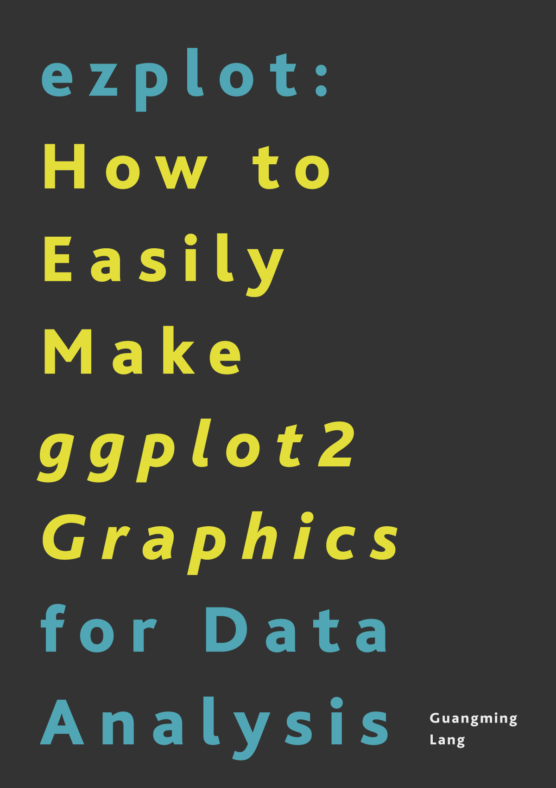

|  | This book teaches you how to use data analysis and machine learning to predict bad loan customers based on their applications and demographic data. It is a step-by-step guide, starting from data cleaning, descriptive and exploratory analysis, data visualization, and finishing at model building and backtesting. Each step is accompanied by a set of R code that are ready to use in your own projects with no or little modifications.    [Read Sample Chapters for FREE.](https://leanpub.com/scorepersonalloanapplicantsusingr/read)|

|  | This book will teach you two things: how to make good statistical charts for presentations or publications, and how to do it fast. If currently it takes you 1 hour to get a plot right and look good, after working through this book, you'll be able to create the same visualization for 5 minutes or less. Yes, it can help you save that much time!    [Read Sample Chapters for FREE.](https://leanpub.com/ezplot/read/preview)|
